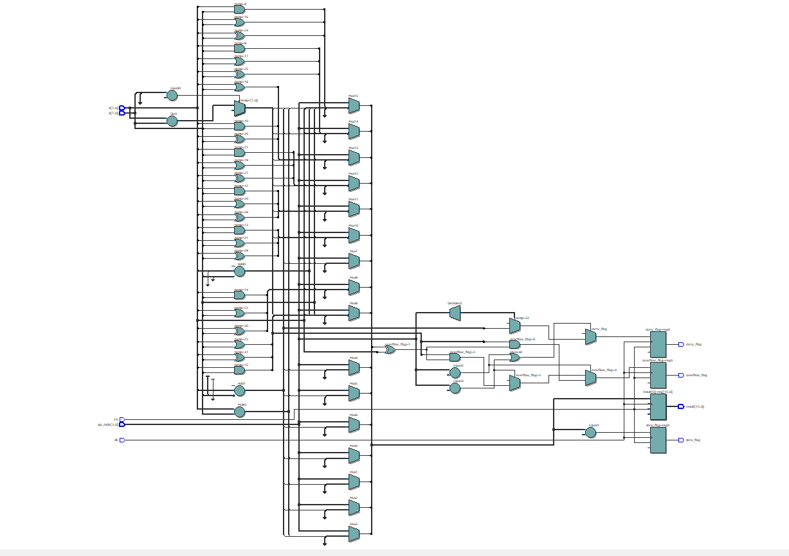
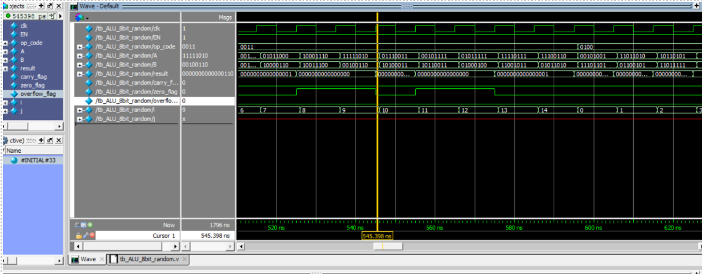
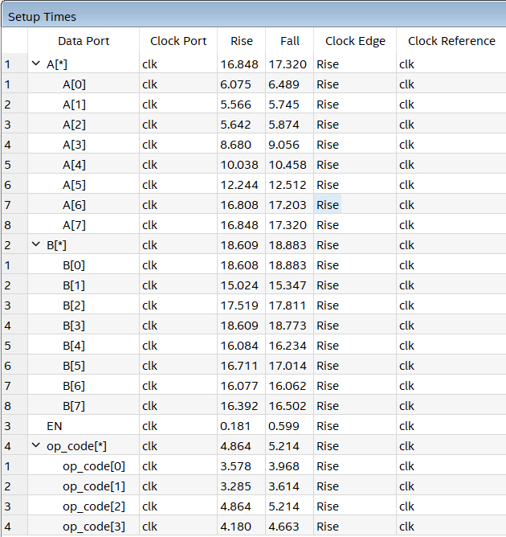
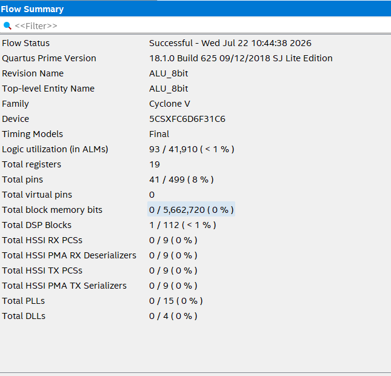

# 8-bit Arithmetic Logic Unit (ALU) RTL Design & Golden Model Verification

> Verilog HDL • RTL Design • Golden Model Verification (MATLAB) • SystemVerilog File I/O • Intel Quartus Prime • ModelSim • Static Timing Analysis

This project implements a synchronous **8-bit Arithmetic Logic Unit (ALU)** using Verilog HDL. It demonstrates a complete, industry-standard digital IC design flow, featuring an **Automated Golden Model Verification Flow** using MATLAB and SystemVerilog, alongside logic synthesis and timing analysis.

The ALU supports 12 distinct arithmetic, logical, and shift operations (including hardware multiplication and division), producing a 16-bit result to prevent overflow/truncation, along with standard processor status flags: **Carry**, **Zero**, and **Overflow**.

---

## 1. Specification

### Objective

Design a synchronous ALU capable of performing arithmetic and logical operations on two 8-bit operands (`A`, `B`) according to a 4-bit operation selector (`op_code`). The design is driven by a system clock and an enable signal.

### Inputs

| Signal | Width | Description |
|---------|-------|-------------|
| `clk` | 1 | System clock |
| `EN` | 1 | ALU enable signal |
| `op_code` | 4 | Operation selector |
| `A` | 8 | Operand A |
| `B` | 8 | Operand B |

### Outputs

| Signal | Width | Description |
|---------|-------|-------------|
| `result` | 16 | ALU computed result (16-bit to accommodate multiplication) |
| `carry_flag` | 1 | Carry/Borrow indication (valid for ADD/SUB) |
| `zero_flag` | 1 | Result equals zero indication |
| `overflow_flag` | 1 | Signed 2's complement arithmetic overflow |

---

## 2. Supported Operations

| `op_code` | Category | Operation | RTL Implementation |
|---------|----------|-----------|--------------------|
| `0000` | Arithmetic | ADD | `A + B` |
| `0001` | Arithmetic | SUB | `A - B` |
| `0010` | Arithmetic | MUL | `A * B` |
| `0011` | Arithmetic | DIV | `A / B` (with divide-by-zero protection) |
| `0100` | Logical | AND | `A & B` |
| `0101` | Logical | OR | `A | B` |
| `0110` | Logical | XOR | `A ^ B` |
| `0111` | Logical | NOT A | `~A` |
| `1000` | Shift | SHL A | `A << 1` |
| `1001` | Shift | SHR A | `A >> 1` |
| `1010` | Shift | SHL B | `B << 1` |
| `1011` | Shift | SHR B | `B >> 1` |

---

## 3. RTL Implementation & Schematic

**Tool:** Intel Quartus Prime

The ALU is implemented as a synchronous RTL module using a single sequential process triggered by the rising edge of the system clock. 

The architecture incorporates a large multiplexer network driven by the `op_code` and utilizes dedicated DSP blocks for multiplication. The synthesized RTL schematic is shown below:



A higher resolution version of the schematic is also provided:
- `docs/schematic_high_res.pdf`

---

## 4. Verification & Simulation

**Tools:** MATLAB, ModelSim, SystemVerilog

To ensure 100% functional correctness, an automated verification pipeline was developed. This flow utilizes a MATLAB Golden Model to generate exhaustive test vectors and a SystemVerilog File I/O testbench for hardware simulation.

```text
[MATLAB Script] --(Generates)--> alu_input.txt & alu_gold.txt
       |
       v
[SystemVerilog TB] --(Reads)--> alu_input.txt
       |
       +---> Drives Signals ---> [ALU RTL (DUT)]
       |
       +---> Logs Results  ---> alu_output.txt
       |
       v
[MATLAB Script] --(Compares)--> alu_output.txt vs alu_gold.txt --> [PASS/FAIL]

**Verification Coverage:**
- **Total Test Vectors:** 786,432 combinations (exhaustive testing across all opcodes and operands).
- **Automation:** ModelSim execution is fully automated via Tcl/DO scripts.
- **Result:** The RTL perfectly matches the Golden Model across all 786,432 test cases.

Automated Checking Result (MATLAB):
========================================
ALU Verification PASSED
786432 / 786432 vectors matched
Functional correctness = 100%
========================================



---

## 5. Synthesis & Static Timing Analysis (STA)

**Tool:** Intel Quartus Prime TimeQuest Timing Analyzer

Following synthesis, Static Timing Analysis (STA) was performed to evaluate setup timing requirements and identify critical timing paths. 

The introduction of complex arithmetic operations (specifically hardware division `A / B`) extends the critical path. The timing report indicates a worst-case setup requirement of:

- **Max Data Path Delay:** `18.883 ns`
- **Estimated Maximum Frequency (Fmax):** `~52.9 MHz`



---

## 6. Resource Utilization

The synthesized ALU utilizes dedicated hardware DSP blocks for multiplication, highly optimizing the standard logic element consumption.

| Resource | Usage |
|----------|-------|
| Logic utilization (ALMs) | 93 / 41,910 (< 1%) |
| Total Registers (FFs) | 19 |
| Total I/O Pins | 41 / 499 (8%) |
| **DSP Blocks** | **1 / 112 (< 1%)** |



---

## 7. Project Structure

8bit-ALU-SV-Verification/
├── .gitignore                 
├── README.md                  
├── docs/                      
│   ├── resource.png           
│   ├── schematic_high_res.pdf 
│   ├── schematic.png 
│   ├── setup_time.png         
│   └── waveform.png           
├── matlab/                    
│   ├── gen_ALU_vectors.m      
│   └── verify_ALU.m           
├── rtl/                       
│   └── ALU_8bit.v             
├── sim/                       
│   ├── compile.do 
│   ├── wave.do 
│   └── run.do                 
└── tb/                        
    ├── tb_ALU_8bit.sv         
    └── tb_ALU_8bit_random.v   

---

## 8. Conclusion

This project serves as a practical demonstration of a complete, industry-standard digital IC verification flow. It showcases:

- **RTL Design:** Parameterized Verilog HDL implementation with DSP inference.
- **Verification Methodology:** End-to-end Automated Golden Model flow.
- **System Integration:** SystemVerilog File I/O (`$fscanf`, `$fdisplay`).
- **Timing Awareness:** Understanding of critical paths, setup time, and trade-offs in hardware arithmetic logic.